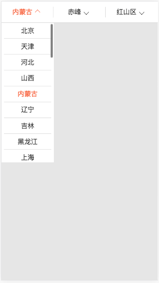

# react-selector
基于移动webapp，制作的一款下拉联动选择器。

### 效果图



### Demo运行步骤

```
git clone https://github.com/bighone/react-selector
cd react-selector
npm install
npm start
```

### BHSelector Props

| 属性 | 类型 | 默认值 | 描述 |
| :-------------: |:-------------:| :-----:| :-----:|
| itemCount | Number | 2| 总共有多少列，默认两列 |
| datas | Array | [] | 联动数据，数据格式固定如下  |
| indexes | Array | [0, 0] | 初始选择的位置，如果越界，索引自动设置为0 |
| handler | Function | 无 | 选择后的回调，返回一个indexes索引集合，例如 [0,1,5] |

datas的数据格式固定为：

```
[{	
	text: 'aaa', 
	datas:[{
		text: 'bbb', 
		datas: ...
	}, {
		text: 'fff', 
		datas: ...
	}]
 }, {
 	text: 'ccc', 
 	datas:[{
 		text: 'ddd', 
 		datas: ...
 	}]
 }]
```

### 相关

[H5之移动端如何让滚动条不隐藏](http://bighone.com/2018/03/20/H5%E4%B9%8B%E7%A7%BB%E5%8A%A8%E7%AB%AF%E5%A6%82%E4%BD%95%E8%AE%A9%E6%BB%9A%E5%8A%A8%E6%9D%A1%E4%B8%8D%E9%9A%90%E8%97%8F/)